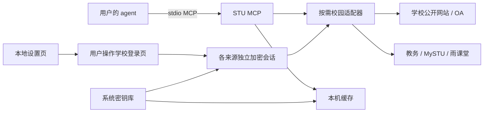

# 架构与产品边界

STU MCP 是面向汕头大学学生的本地校园工具。分析、总结、建议与模型调用由用户的 agent 完成。

选择标准 **stdio MCP** 作为接入方式，用同一个服务覆盖 Codex、Claude Code、Cursor 和其他支持本地 MCP 的 agent。CLI 是安装、诊断和无 MCP 环境的补充入口，产品名称仍是 STU MCP。先做 MCP 服务与简洁设置页，避免维护互不相通的多套 agent 专用实现。

## 模块

| 模块 | 职责 |
| --- | --- |
| `sources` | 功能、目标地址和认证依赖声明 |
| `network` | 限定主机、默认 HTTPS、独立教务 HTTP 兼容、cookie 范围和读取上限 |
| `parsers` / `collectors` | 无配置副作用的解析与按需获取，报告数据范围和部分失败 |
| `runtime` / `vault` / `store` | 用户目录、系统密钥库、加密会话与个人缓存 |
| `auth` / `setup_web` | 浏览器手动登录、安全本地设置和来源独立退出 |
| `clients` | 保留其他配置、备份、预览、幂等接入 |
| `server` / `cli` | MCP 协议与可诊断的 JSON 命令行 |

## 认证依赖

公开网站无需账号。OA 先匿名访问，不成功时才尝试可选 WebVPN 会话；只允许 HTTPS 认证代理，不对旧 HTTP 代理发送 cookie。教务和 MySTU 分别登录学校统一认证；雨课堂在自己的官方页面登录，可能使用扫码。二维码登录不赋予工具读取微信消息的能力。

服务无需用户复制 token。首版将登录得到的 cookie/local storage 作为每个来源的独立会话，过期后重新打开对应学校登录页。没有一个强制配置全量字段的 `.env`，没有模型密钥配置。

学校旧教务 HTTP 接口通过本地 `jw_http_compat` 选项兼容，默认关闭；开关不接受 MCP 参数，必须在本地设置页选择。统一认证从 HTTPS SSO 开始，只有教务主机允许 HTTP 回调与查询。来源状态返回当前传输选项；刷新结果标明 `school_legacy_http` 或 `https`。

## 数据与范围

查询默认读缓存，刷新由 agent 或用户按需发起。每条记录带 `source` 与 `collected_at`，刷新返回 `coverage`、`limited`、`errors` 和来源时间。初版是有界读取：近期栏目、OA 列表第一页、最新可用学期课程，不声称覆盖全部学校信息。

失败刷新保留旧缓存，并记录失败状态。成绩按学校表格保存，统计明确包含非数值排除和重修处理口径。待办的本地 `status` 与学校提供的 `school_status` 分开，不提交作业、不修改学校业务记录。

这是全新历史的独立仓库。没有复制原项目的 Git 历史、运行数据库、个人画像、`.env`、登录态、Hermes 运行目录或部署配置。
